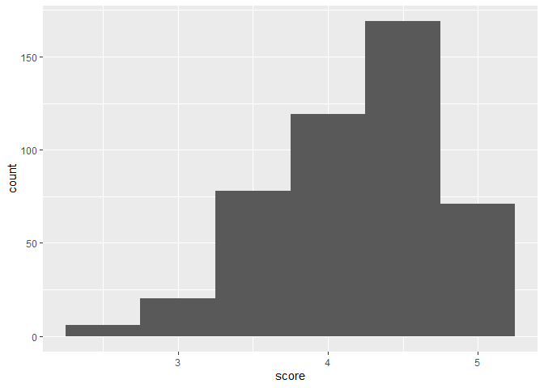
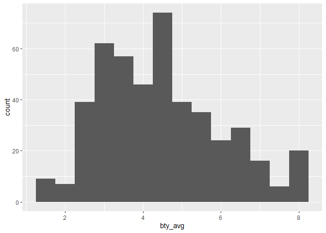
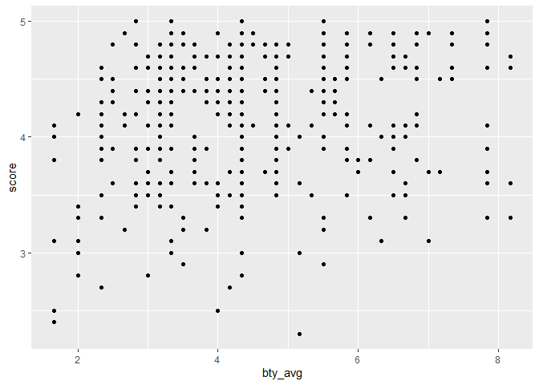
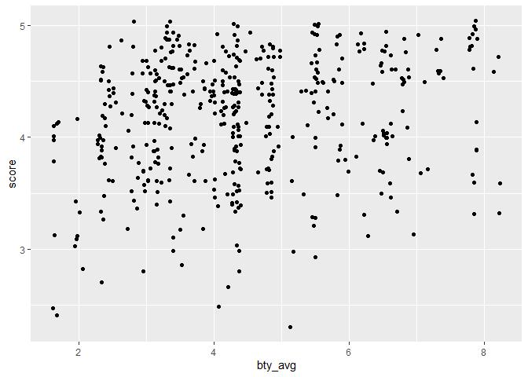
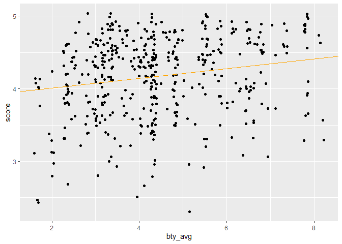

Lab 09 - Grading the professor, Pt. 1
================
Fanyi Zeng
03/13/22

In this lab, we are going to look at the predictors of a positive
professor evaluation score. The data was collected based on
end-of-semester professor ratings from U-T Austin. The professors were
also rated in their physical attractiveness by six students. The
original study found that higher physical attractiveness predicts more
positive ratings (Hamermesh and Parker, 2005).

### Load packages and data

``` r
library(tidyverse) 
library(tidymodels)
library(openintro)
```

    ## Warning: package 'openintro' was built under R version 4.1.3

    ## Warning: package 'airports' was built under R version 4.1.3

    ## Warning: package 'cherryblossom' was built under R version 4.1.3

    ## Warning: package 'usdata' was built under R version 4.1.3

``` r
library(broom)
```

``` r
evals
```

    ## # A tibble: 463 x 23
    ##    course_id prof_id score rank    ethnicity gender language   age cls_perc_eval
    ##        <int>   <int> <dbl> <fct>   <fct>     <fct>  <fct>    <int>         <dbl>
    ##  1         1       1   4.7 tenure~ minority  female english     36          55.8
    ##  2         2       1   4.1 tenure~ minority  female english     36          68.8
    ##  3         3       1   3.9 tenure~ minority  female english     36          60.8
    ##  4         4       1   4.8 tenure~ minority  female english     36          62.6
    ##  5         5       2   4.6 tenured not mino~ male   english     59          85  
    ##  6         6       2   4.3 tenured not mino~ male   english     59          87.5
    ##  7         7       2   2.8 tenured not mino~ male   english     59          88.6
    ##  8         8       3   4.1 tenured not mino~ male   english     51         100  
    ##  9         9       3   3.4 tenured not mino~ male   english     51          56.9
    ## 10        10       4   4.5 tenured not mino~ female english     40          87.0
    ## # ... with 453 more rows, and 14 more variables: cls_did_eval <int>,
    ## #   cls_students <int>, cls_level <fct>, cls_profs <fct>, cls_credits <fct>,
    ## #   bty_f1lower <int>, bty_f1upper <int>, bty_f2upper <int>, bty_m1lower <int>,
    ## #   bty_m1upper <int>, bty_m2upper <int>, bty_avg <dbl>, pic_outfit <fct>,
    ## #   pic_color <fct>

### Part 1: Exploratory Data Analysis

The distribution of evaluation score is negative (left) skewed, which
means most professors get a satisfactory score. The distribution of
beauty rating is positive (right) skewed, which means only a small
number of professors are considered very attractive.

``` r
evals %>%
  ggplot(aes(x=score))+
  geom_histogram(binwidth=0.5)
```

<!-- -->

``` r
evals %>%
  ggplot(aes(x=bty_avg))+
  geom_histogram(binwidth=0.5)
```

<!-- -->

Let’s visualize the relationship between professors’ average evaluation
scores and their average beauty ratings.

``` r
evals %>%
  ggplot(aes(y=score, x=bty_avg)) +
  geom_point()
```

<!-- -->

We can also use jitter geom. It adds a small amount of random deviation
to each point to avoid over-plotting.

``` r
evals %>%
  ggplot(aes(y=score, x=bty_avg)) +
  geom_jitter()
```

<!-- -->

There does seem to be a moderate relationship between beauty ratings and
evaluation scores.

### Part 2: Linear regression with a numerical predictor

The linear regression model of using average beauty ratings to predict
average evaluation scores could be written as the following formula:

evaluation score = 3.88034 + 0.06664 \* beauty rating

``` r
m_bty <- lm(score ~ bty_avg, data=evals)
summary(m_bty)
```

    ## 
    ## Call:
    ## lm(formula = score ~ bty_avg, data = evals)
    ## 
    ## Residuals:
    ##     Min      1Q  Median      3Q     Max 
    ## -1.9246 -0.3690  0.1420  0.3977  0.9309 
    ## 
    ## Coefficients:
    ##             Estimate Std. Error t value Pr(>|t|)    
    ## (Intercept)  3.88034    0.07614   50.96  < 2e-16 ***
    ## bty_avg      0.06664    0.01629    4.09 5.08e-05 ***
    ## ---
    ## Signif. codes:  0 '***' 0.001 '**' 0.01 '*' 0.05 '.' 0.1 ' ' 1
    ## 
    ## Residual standard error: 0.5348 on 461 degrees of freedom
    ## Multiple R-squared:  0.03502,    Adjusted R-squared:  0.03293 
    ## F-statistic: 16.73 on 1 and 461 DF,  p-value: 5.083e-05

The relationship between average beauty rating and evaluation scores is
positive and significant, but not strong.

The intercept of the line tells us that if a professor’s perceived
attractiveness is 0, then they will have a evaluation score of 3.9/5,
which is pretty high. The influence of attractiveness on evaluation is
weak.

The R squared of the model is 0.03293, which means only 3.3% of variance
in one’s evaluation score is explained by one’s average beauty rating.

``` r
evals %>%
  ggplot(aes(y=score, x=bty_avg)) +
  geom_jitter() +
  geom_abline(intercept = 3.88034, slope = 0.06664, color="orange")
```

<!-- -->

### Part 3: Linear regression with a categorical predictor

The regression line of gender and evaluation is: evaluation score =
4.09282 + 0.14151 \* gender

The intercept indicates that female professors have an average
evaluation score of 4.09282, and male professors have a slightly higher
average evaluation score of 4.09282 + 0.14151 = 4.23433.

``` r
m_gen <- lm(score~gender, evals)
summary(m_gen)
```

    ## 
    ## Call:
    ## lm(formula = score ~ gender, data = evals)
    ## 
    ## Residuals:
    ##      Min       1Q   Median       3Q      Max 
    ## -1.83433 -0.36357  0.06567  0.40718  0.90718 
    ## 
    ## Coefficients:
    ##             Estimate Std. Error t value Pr(>|t|)    
    ## (Intercept)  4.09282    0.03867 105.852  < 2e-16 ***
    ## gendermale   0.14151    0.05082   2.784  0.00558 ** 
    ## ---
    ## Signif. codes:  0 '***' 0.001 '**' 0.01 '*' 0.05 '.' 0.1 ' ' 1
    ## 
    ## Residual standard error: 0.5399 on 461 degrees of freedom
    ## Multiple R-squared:  0.01654,    Adjusted R-squared:  0.01441 
    ## F-statistic: 7.753 on 1 and 461 DF,  p-value: 0.005583

The regression line of rank and evaluation is: evaluation score =
4.28431 - 0.12968 \* tenure track - 0.14518 \* tenured

The intercept indicates that teaching professors have an average
evaluation score of 4.28431, tenure track professors have a slightly
lower average evaluation score of 4.28431 - 0.12968 = 4.15463, and
tenured professors have a slighlt lower avarage evaluation score of
4.28431 - 0.14518 = 4.13913.

``` r
m_rank <- lm(score~rank, evals)
summary(m_rank)
```

    ## 
    ## Call:
    ## lm(formula = score ~ rank, data = evals)
    ## 
    ## Residuals:
    ##     Min      1Q  Median      3Q     Max 
    ## -1.8546 -0.3391  0.1157  0.4305  0.8609 
    ## 
    ## Coefficients:
    ##                  Estimate Std. Error t value Pr(>|t|)    
    ## (Intercept)       4.28431    0.05365  79.853   <2e-16 ***
    ## ranktenure track -0.12968    0.07482  -1.733   0.0837 .  
    ## ranktenured      -0.14518    0.06355  -2.284   0.0228 *  
    ## ---
    ## Signif. codes:  0 '***' 0.001 '**' 0.01 '*' 0.05 '.' 0.1 ' ' 1
    ## 
    ## Residual standard error: 0.5419 on 460 degrees of freedom
    ## Multiple R-squared:  0.01163,    Adjusted R-squared:  0.007332 
    ## F-statistic: 2.706 on 2 and 460 DF,  p-value: 0.06786

Let’s relevel rank and make tenure track the baseline level.

The regression line of the releveled rank and evaluation is: evaluation
score = 4.15463 - 0.12968 \* teaching - 0.14518 \* tenured

The intercept indicates that tenure track professors have an average
evaluation score of 4.15463, teaching professors have a slightly higher
average evaluation score of 4.15463 + 0.12968 = 4.28431, and tenured
professors have a slightly lower average evaluation score of 4.15463 -
0.01550 = 4.13913.

The adjusted R squared is 0.007332, such that only 0.7% of variance is
explained by the releveld rank.

``` r
rank_relevel <- relevel(evals$rank, "tenure track")
m_rank_2 <- lm(score~rank_relevel, evals)
summary(m_rank_2)
```

    ## 
    ## Call:
    ## lm(formula = score ~ rank_relevel, data = evals)
    ## 
    ## Residuals:
    ##     Min      1Q  Median      3Q     Max 
    ## -1.8546 -0.3391  0.1157  0.4305  0.8609 
    ## 
    ## Coefficients:
    ##                      Estimate Std. Error t value Pr(>|t|)    
    ## (Intercept)           4.15463    0.05214  79.680   <2e-16 ***
    ## rank_relevelteaching  0.12968    0.07482   1.733   0.0837 .  
    ## rank_releveltenured  -0.01550    0.06228  -0.249   0.8036    
    ## ---
    ## Signif. codes:  0 '***' 0.001 '**' 0.01 '*' 0.05 '.' 0.1 ' ' 1
    ## 
    ## Residual standard error: 0.5419 on 460 degrees of freedom
    ## Multiple R-squared:  0.01163,    Adjusted R-squared:  0.007332 
    ## F-statistic: 2.706 on 2 and 460 DF,  p-value: 0.06786

Now let’s create a new variable called tenure_eligible that labels
“teaching” faculty as “no” and labels “tenure track” and “tenured”
faculty as “yes”.

The regression line of tenure eligibility and evaluation is: evaluation
score = 4.2843 - 0.1406 \* tenure eligibility

The intercept indicates that teaching professors have an average
evaluation score of 4.2843, and tenure eligible professors have a
slightly lower average evaluation score of 4.2843 - 0.1406 = 4.1437.

The adjusted R squared is 0.009352, such that only 0.9% of variance is
explained by tenure eligibility.

``` r
evals <- evals %>%
  mutate(tenure_eligible = case_when (
    rank == "teaching" ~ 0, 
    rank == "tenure track" ~ 1, 
    rank == "tenured" ~ 1))
m_rank_3 <- lm(score~tenure_eligible, evals)
summary(m_rank_3)
```

    ## 
    ## Call:
    ## lm(formula = score ~ tenure_eligible, data = evals)
    ## 
    ## Residuals:
    ##     Min      1Q  Median      3Q     Max 
    ## -1.8438 -0.3438  0.1157  0.4360  0.8562 
    ## 
    ## Coefficients:
    ##                 Estimate Std. Error t value Pr(>|t|)    
    ## (Intercept)       4.2843     0.0536  79.934   <2e-16 ***
    ## tenure_eligible  -0.1406     0.0607  -2.315    0.021 *  
    ## ---
    ## Signif. codes:  0 '***' 0.001 '**' 0.01 '*' 0.05 '.' 0.1 ' ' 1
    ## 
    ## Residual standard error: 0.5413 on 461 degrees of freedom
    ## Multiple R-squared:  0.0115, Adjusted R-squared:  0.009352 
    ## F-statistic: 5.361 on 1 and 461 DF,  p-value: 0.02103
